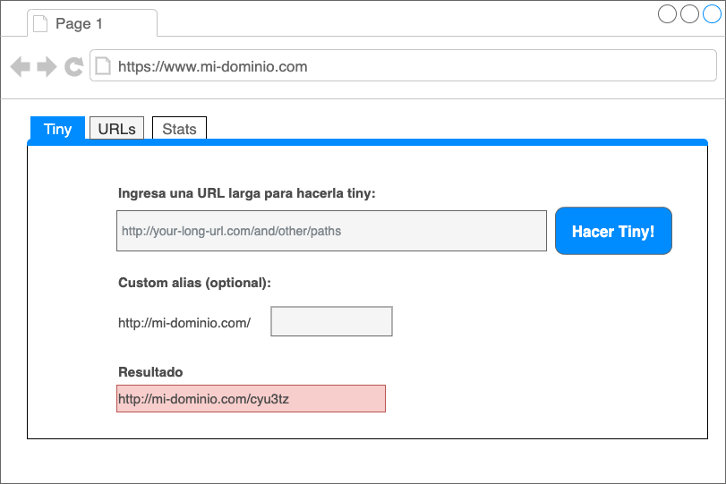

---
<!-- TOC -->

- [Intro](#intro)
- [App](#app)
  - [Tiny URLs](#tiny-urls)
    - [Modo Normal](#modo-normal)
    - [Modo Custom](#modo-custom)
    - [Funcionamiento](#funcionamiento)
  - [Ejemplos:](#ejemplos)
  - [URLS](#urls)
  - [stats](#stats)

<!-- /TOC -->


# Intro
Haremos un creador de tiny url (URL shortener), aplicaremos conceptos de CS como:

- REST APIs
- Web development
- key-val databases, [Redis](https://redis.io/topics/introduction)
- HTTP verbs
- HTTP responses


---
# App

Es importante que su aplicacion tenga un dominio, casi en todos los proyectos hemos trabajado con `127.0.0.1:5000` pero ese no es un dominio real, para usar un nombre de dominio hay varias maneras, gratis

- [/etc/hosts](https://support.acquia.com/hc/en-us/articles/360004175973-Using-an-etc-hosts-file-for-custom-domains-during-development#:~:text=The%20%2Fetc%2Fhosts%20file%20contains,before%20making%20a%20website%20live.)
- [nip.io](https://nip.io/) [Recomendado]
- se puede no usar dominio y seguir usando `127.0.0.1:5000`

> se puede obtener dinamicamente el HOST url con el [Host Header](https://stackoverflow.com/questions/43156023/what-is-http-host-header)


---
La aplicacion se vera asi:




La app tendra por lo menos 3 vistas (3 rutas):

1. [`/`](#tiny-urls) : Crear tinyURL
2. [`/urls`](#urls): lista de URLs
3. [`/stats`](#stats): estadistica de clicks y visitas

## Tiny URLs

### Modo Normal
En esta vista se podra generar un tinyURL, el usuario ingresa una URL cualquiera (www.google.com por ejemplo) apachara el boton magico y su app debera hacer lo siguiente:

1. Recibir la URL
2. Generar un ["token/identificador" unico](https://pypi.org/project/shortuuid/) (ejemplo: cyu3tzA)
3. Guardar ese token en la base de datos (key-val) donde el "token" sera el key y la URL sera el val
4. Debera responder con la tinyURL generada al usuario.


### Modo Custom

En esta modalidad sucedera todo lo anterior con la excepcion del paso "2" en donde el usuario ademas del URL tambien podra ingresar un customID (palabra unica que identifique a su URL)

```bash
Ejemplo:

URL: www.google.com
customID: mi-url

Resultado => http://su-dominio.com/mi-url

```

### Funcionamiento

Cuando el usuario pegue en su browser, obviamente su aplicacion respondera y recibira este request debera [REDIRIGIR](https://moz.com/learn/seo/redirection) al usuario a la URL original.


```
Ejemplo:

Browser: http://su-dominio.com/mi-url

App: recibe [http://su-dominio.com/mi-url]

Browser: [redirect] www.google.com
```

## Ejemplos:

- [https://tinyurl.com/](https://tinyurl.com/)
- [https://tiny.cc/](https://tiny.cc/)

---

## URLS
En esta vista se mostraran todas las URLs convertidas hasta el momento, sera mostrado en una tabla a 2 columnas

| tinyURL                       	|                Original URL                	|
|-------------------------------	|:------------------------------------------|
| http://mi-dominio.com/sasd3av 	| https://miu.ufm.edu/mis_cursos_detalle.php 	|
| http://mi-dominio.com/1wsqzdf 	| https://docs.google.com/document/d/1       	|
| http://mi-dominio.com/correo  	| https://mail.google.com/mail/u/            	|


el mockup para esta funcion seria este:


---
## stats

---

